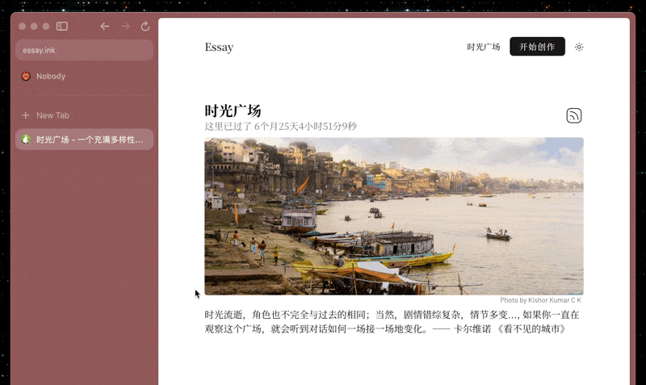
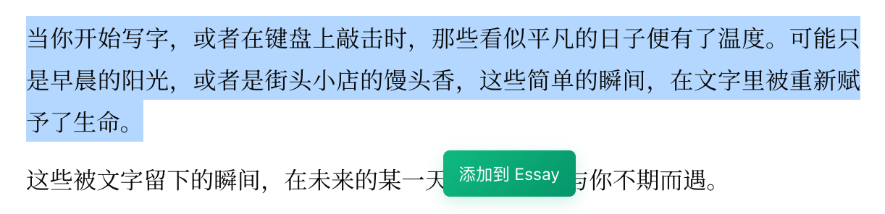

# Essay.ink 浏览器助手

帮助你快速创建 Essay/Note 内容.

## 核心功能

- 快速创建 Essay/Note
- 划词选中内容直接创建, 自动标记来源网页

## 安装方法

1. 下载本仓库压缩包
2. 解压文件
3. 打开Chrome浏览器, 进入扩展管理页面
4. 开启"开发者模式"
5. 点击"加载已解压的扩展程序", 选择解压后的文件夹

## 配置说明

### 设置 API Key

1. 访问 [Essay API 设置页面](https://www.essay.ink/i/settings/api), 开启 API 并获取 Key.
   
   

2. 点击扩展图标, 在设置中填入 API Key.
   
   

## 使用指南

### 基本使用

在网页中选择文字, 点击扩展图标自动填入编辑框. 选择创建类型（Essay 或 Note）, 完成编辑后点击"发送到 Essay"即可. 

### 自动添加来源链接

开启此功能后, 划词内容会自动添加页面来源信息：`> 来源: [网页标题](网页链接)`

### 悬浮按钮

选中文字后, 页面会显示悬浮按钮, 点击即可快速开始编辑. 

> 可在设置中关闭悬浮按钮功能

## 开发计划

- [ ] 图片插入功能
- [ ] 自定义内容模板
- [ ] 更多功能...